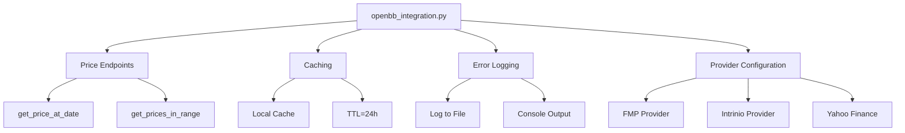

# Backtesting App Development Plan

## OpenBB Integration Module

### File Structure
```
flask_backtest_app/
├── openbb_integration.py   # New module
├── .env                    # API key configuration
├── data/
│   ├── cache/             # Cached API responses
│   └── logs/              # Error logs
```

### Module Architecture


### Implementation Details

1. **Price Endpoints**:
   - `get_price_at_date(symbol: str, date: str) -> float`
     * Returns closing price for specific date
     * Provider fallback sequence: yfinance → fmp → intrinio
   - `get_prices_in_range(symbol: str, start_date: str, end_date: str) -> pd.DataFrame`
     * Returns daily prices (open, high, low, close, volume) for date range

2. **Provider Configuration**:
   - FMP API key required (get from https://financialmodelingprep.com)
   - Configure via .env file:
     ```
     FMP_API_KEY=your_api_key_here
     ```
   - Uses python-dotenv to load environment variables
   - Add .env to .gitignore to protect secrets

3. **Caching**:
   - Cache location: `flask_backtest_app/data/cache`
   - TTL: 24 hours
   - Cache key format: `{symbol}_{date_or_range}`

4. **Error Handling**:
   - Log file: `flask_backtest_app/data/logs/openbb_errors.log`
   - Log format: `[timestamp] [LEVEL] [symbol] - message`
   - Console output for immediate visibility
   - Detailed provider fallback logging

5. **Dependencies**:
   - Add to requirements.txt:
     * openbb
     * pandas
     * cachetools
     * python-dotenv