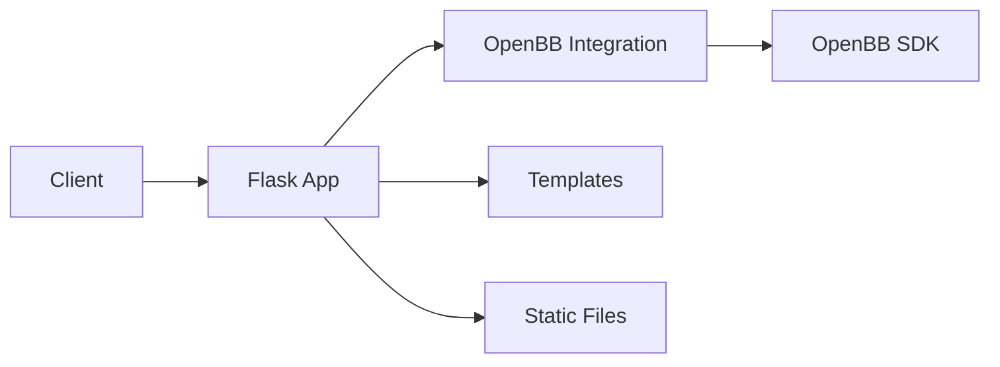
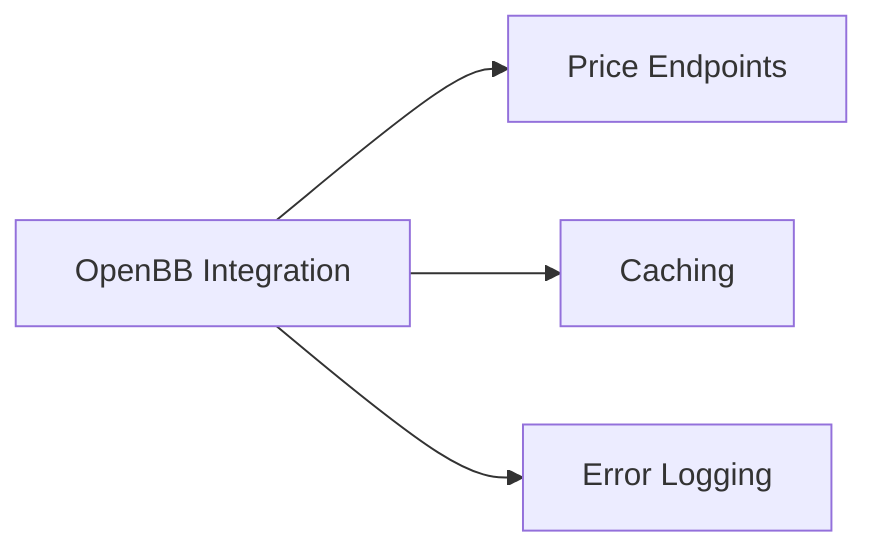

# Backtesting App Development Plan

## Project Structure

```
.
├── .gitignore
├── plan.md
├── backtest-app/
│   └── public/
│       └── strategies.yaml
└── flask_backtest_app/
    ├── app.py
    ├── openbb_integration.py
    ├── requirements.txt
    ├── data/
    │   ├── cache/
    │   └── logs/
    │       └── openbb_errors.log
    ├── static/
    │   ├── favicon.ico
    │   └── css/
    │       └── style.css
    │   └── js/
    │       └── stock_suggestions.js
    └── templates/
        ├── base.html
        ├── index.html
        └── stock_details.html
```

## Architecture Design



*   **Client (Browser)**: The user interacts with the application through a web browser.
*   **Flask Application (`app.py`)**: The core of the application. It handles routing, user requests, and rendering templates.
*   **OpenBB Integration (`openbb_integration.py`)**: This module provides an interface to the OpenBB SDK for fetching stock data, news, and company information. It also implements caching to improve performance.
*   **Templates (`templates/`)**: This directory contains the HTML templates used to generate the user interface.
    *   `base.html`: Provides the base structure for all pages.
    *   `index.html`: The main page, which displays the backtesting form and results.
    *   `stock_details.html`: Displays detailed information about a specific stock.
*   **Static Files (`static/`)**: This directory contains static files such as CSS and JavaScript.
    *   `style.css`: Contains the CSS styles for the application.
    *   `stock_suggestions.js`: Provides stock ticker suggestions as the user types.
*   **OpenBB SDK**: The OpenBB SDK is used to fetch financial data.

## OpenBB Integration Module

### Module Architecture



### Implementation Details

1.  **Price Endpoints**:
    *   `get_price_at_date(symbol: str, date: str) -> float`
        *   Returns closing price for specific date
    *   `get_prices_in_range(symbol: str, start_date: str, end_date: str) -> pd.DataFrame`
        *   Returns daily prices (open, high, low, close, volume) for date range

2.  **Caching**:
    *   Cache location: `flask_backtest_app/data/cache`
    *   TTL: 24 hours

3.  **Error Handling**:
    *   Log file: `flask_backtest_app/data/logs/openbb_errors.log`
    *   Log format: `[timestamp] [LEVEL] [symbol] - message`
    *   Console output for immediate visibility

4.  **Dependencies**:
    *   Add to requirements.txt:
        *   Flask
        *   openbb
        *   pandas
        *   cachetools
        *   python-dotenv